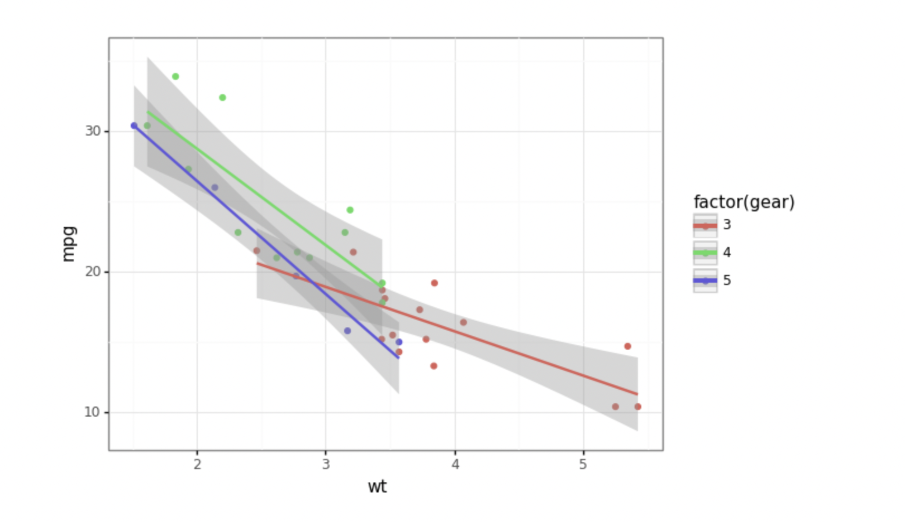

# TATA--visulization-project

## Task -1 
- using data exploration You’ve been provided a dataset in the resources below to use as the basis .
- An online retail store has hired you as a consultant to review their data and provide insights that would be valuable to the CEO and CMO of the business. 
- They would also like to view different metrics based on the demographic information that is available in the data.
- Create a set of four questions that you anticipate each business leader will ask and want to know the answers to. 

## Task- 2
- to pick the right visulization for diffrent scenario.
- tabulue and powe BI These are the brilliant tool to perform data cleaning, data preprocessing, and data visualization in many analytics projects.
- plotnine is a data visualization package for the programming language Python that is inspired by the ggplot2 package for R. It allows users to create a wide range of static, animated, and interactive visualizations in Python.

We always start by loading up and looking at the dataset we want to analyze and visualize. 
```
from plotnine import *
from plotnine.data import mtcars

mtcars.head()
```
We choose a dot or scatter plot in this case for our geometric object to represent each data point.
```
(ggplot(mtcars, 
        aes('wt', 'mpg', 
            color='factor(gear)'))
        + geom_point() 
        + facet_wrap('~cyl') 
        + theme_bw())
```
* theme_bw() is a function in the ggplot2 package that sets the default theme for a plot to a simple black and white theme.
* function to create a new plot object, and then use functions like geom_point() and geom_line() to add layers to the plot.

## charts 
1. line graph(number)/ trend
 Whether you’re analyzing sales data, whether you’re looking at year-on-year profit, whether you’re looking at how a person’s salary increases in the last year, line charts are very helpful in these scenarios.
2. bar grapgh 
The only difference between them is that in a bar chart, values are represented on the X-axis and categories on the Y-axis.
3. column graph 
similar as bar , column will be resprented on x-axies and comparing 2 or 3 diffrent categroius 
4. scaltter plot(number)
continous varibales , Scatter plots are useful for showing a correlation between the data points that may not be easy to see from the data alone.
5 histogram - for frequency(number)/ stastic hiher to lower
6.Pie Chart- precentage value
If you want to represent your categorical data as part of the whole, then you should use a pie chart.
7.vilion graph
8.treemap
9.area chat to compare mutiple categrious 
10. gauage -to show the progrees 
11. stacked bar - to comapre in the same subplot bar
- a linear approach for modelling the relationship between a scalar response and one or more explanatory variables (also known as dependent and independent variables).
```
(ggplot(mtcars, 
        aes('wt', 'mpg', 
            color='factor(gear)'))
        + geom_point() 
        + stat_smooth(method='lm') 
        + theme_bw())
```
	
The ggplot() function creates a new plot object and takes a dataset (mtcars) and aes (aesthetics) as arguments. 
## important note 
1. Avoid using too many colors "rainbow effect".  Using a single color, or varying shades of the same color, is a much better practice
2. Label the axes - Labelling the axes gives your viewer context

## Task -3 
 - creating visual
a. 1 step is to clean the data set from excel file and clean the unit price error  values and neative quantitiy or use  transformation method to clean the data
- use (abs A1) to invert it to positive 
b. 2 step is to use the visulization tool for the stakeholders to take a business insights by the visuls created for each question asked by ceo and cmo in  total 4 worksheet visul to be presented 
1.line chart - renvue to calculate , cutomer and quantity  
2.side by side chart top 10 countries , quantity , and renvue 
3. map find invice max country used 
4. column top 10 by country in descinding order 

## Task 4
- storytelling
- -It is important to explain your thought process and ideas in a clear and straightforward way. You are also required to clearly present the analysis of all four questions from the previous task. 
- When writing your script, you should speak about your entire process, including the initial data load and clean-up steps so that your leaders know you’ve done your due diligence in providing error-free analysis. 
-Data analysis provides heaps of information but remember to focus on the information that is most important to your leaders.
- make a script and record a video 
